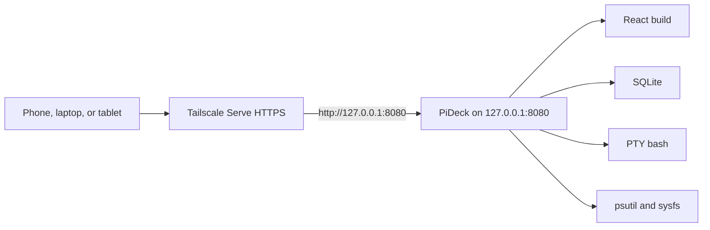

# PiDeck

PiDeck is a small web control center for a Raspberry Pi. It shows live CPU, memory, storage, network, and power stats, and it opens a real shell in the browser. You develop it on a laptop, push it to GitHub, and run it on the Pi as one local service.

The service binds to `127.0.0.1:8080` only. Tailscale Serve publishes it on your tailnet over HTTPS. It is not exposed to the public internet, and it does not use Tailscale Funnel. Tailscale decides who can open the site. PiDeck still asks for its own username and password.

## Screenshots

Screenshots belong here after the first run on the Pi:

- `docs/screenshots/dashboard.png`
- `docs/screenshots/terminal.png`
- `docs/screenshots/settings.png`

## Architecture



One Python process serves the API, the terminal WebSocket, and the built frontend. Node is only needed while building the UI.

## Features

- Live system snapshot about every 2 seconds: CPU, per-core load, temperature, frequency, load average, memory, storage, network, uptime, OS, and Raspberry Pi model when Linux exposes it
- Battery percent, charging state, and voltage when sysfs or psutil can see a battery. If there is no battery, the card says `Battery information unavailable` and the app keeps running
- Browser terminal backed by a Linux PTY, with resize, ANSI color, and the normal shell behavior for programs such as `htop`, `nano`, and `vim`
- Local users in SQLite, Argon2id password hashes, and HttpOnly session cookies
- Blue, Hacker Green, Purple, Red, and custom themes stored on the user and in the browser
- systemd unit and install, update, and uninstall scripts
- No Docker and no default password

## Repository layout

```text
backend/          FastAPI app, auth, monitoring, PTY terminal, tests
frontend/         React + Vite + TypeScript + xterm.js
scripts/          install.sh, update.sh, uninstall.sh
systemd/          pideck.service template
data/             SQLite database at runtime (not committed)
.env.example      configuration template
```

## Development on Windows

Use two terminals from the repository root.

Python:

```powershell
py -m venv backend\.venv
.\backend\.venv\Scripts\Activate.ps1
pip install -r backend\requirements.txt
pip install -r backend\requirements-dev.txt
Copy-Item .env.example .env
python -c "import secrets; print(secrets.token_urlsafe(48))"
```

Put that secret in `.env` as `PIDECK_SESSION_SECRET`. For day-to-day UI work you can instead set `PIDECK_DEV=true` and leave the example placeholder; PiDeck will use a temporary secret and warn you. Do not do that on the Pi.

```powershell
$env:PIDECK_DEV = "true"
python -m backend
```

The API listens on `http://127.0.0.1:8080`.

Create the first user in another terminal, with the virtual environment active and the repository root as the working directory:

```powershell
python -m backend.create_user
```

Frontend:

```powershell
cd frontend
npm install
npm run dev
```

Open `http://127.0.0.1:5173`. Vite proxies `/api` and `/ws` to FastAPI.

The Windows terminal page is a development fallback. It is not a PTY, so full-screen programs will not behave like they do on the Pi. The Linux PTY is unchanged.

Useful checks:

```powershell
pytest
cd frontend
npm run typecheck
npm run build
```

`uvicorn backend.main:app --reload --host 127.0.0.1 --port 8080` also works from the repository root. Prefer `python -m backend`, which refuses a public bind address.

## Development on Linux

From the repository root:

```bash
python3 -m venv backend/.venv
source backend/.venv/bin/activate
pip install -r backend/requirements.txt
pip install -r backend/requirements-dev.txt
cp .env.example .env
python -c "import secrets; print(secrets.token_urlsafe(48))"
```

Edit `.env`, set `PIDECK_DEV=true` while you are working locally, then:

```bash
python -m backend
```

In another terminal:

```bash
python -m backend.create_user
cd frontend
npm install
npm run dev
```

Run `pytest` from the repository root.

## Raspberry Pi installation

On the Pi, as the normal user that should own the dashboard (not root):

```bash
git clone https://github.com/YOUR_USER/pideck.git
cd pideck
chmod +x scripts/*.sh
./scripts/install.sh
```

The installer:

1. Checks that it is Linux and that it is not running as root
2. Asks before installing missing `python3`, `venv`, `nodejs`, or `npm` packages
3. Creates `backend/.venv` and installs Python dependencies
4. Installs frontend dependencies and builds the UI
5. Writes `.env` with a random session secret if `.env` does not exist
6. Prompts for the first username and password if the database has no users
7. Installs and starts `pideck.service` with sudo
8. Prints the Tailscale Serve commands for you to run yourself

Python 3.11+ and Node.js 18+ are required. If `pip` fails on 32-bit Raspberry Pi OS because a wheel is missing:

```bash
sudo apt-get install -y build-essential python3-dev libffi-dev
./scripts/install.sh
```

A Raspberry Pi 3B+ with 1 GB of RAM can run out of memory while Vite builds. If `npm run build` is killed, add swap and run `./scripts/update.sh` again.

PiDeck does not install or configure Tailscale for you.

## First user

There is no default password. From the repository root, with the virtual environment's Python:

```bash
backend/.venv/bin/python -m backend.create_user
```

The command asks for a username and a password (minimum 10 characters). Passwords are stored as Argon2id hashes.

Add another account later:

```bash
backend/.venv/bin/python -m backend.create_user --add
```

Avoid `--password` when you can. It shows up in the process list. A prompt, or the `PIDECK_SETUP_PASSWORD` environment variable, is safer.

## systemd

`scripts/install.sh` renders `systemd/pideck.service` with your user, group, and checkout path, copies it to `/etc/systemd/system/pideck.service`, enables it, and starts it.

The process runs as that user, with the repository as its working directory:

```bash
backend/.venv/bin/python -m backend
```

That command reads `.env` and binds `PIDECK_HOST` / `PIDECK_PORT`, which default to `127.0.0.1:8080`. The app exits if the host is not localhost unless `PIDECK_ALLOW_NON_LOCALHOST=true`. Leave that flag false.

The unit restarts after a crash, then stops retrying if it fails five times in a minute.

```bash
systemctl status pideck
journalctl -u pideck -n 100 --no-pager
sudo systemctl restart pideck
```

The unit does not enable `NoNewPrivileges`, `ProtectSystem`, or `PrivateTmp`. Those sandbox options would break the browser shell and normal `sudo`.

## Tailscale

Install Tailscale using Tailscale's own instructions and join the Pi to your tailnet. Then:

```bash
sudo tailscale serve --bg 8080
tailscale serve status
```

`tailscale serve --bg 8080` keeps an HTTPS proxy on the tailnet pointed at `http://127.0.0.1:8080`. It survives reboot. Do not run `tailscale funnel`. Funnel would publish the Pi beyond your tailnet.

Your tailnet ACL still applies. PiDeck's login is a second check, and it stays on.

Disable this proxy:

```bash
sudo tailscale serve --bg 8080 off
tailscale serve status
```

`tailscale serve reset` deletes every Serve handler on the Pi, including ones that are not PiDeck. Use it only when that is what you want.

### Cookies behind Tailscale

Tailscale terminates HTTPS and forwards HTTP to localhost. `PIDECK_COOKIE_SECURE=auto` marks the session cookie `Secure` when `X-Forwarded-Proto` is `https`, which Serve sends. The cookie is HttpOnly and `SameSite=Lax`.

Use `PIDECK_COOKIE_SECURE=false` only for plain `http://127.0.0.1` during development. If a Tailscale login succeeds and the browser immediately forgets it, set `PIDECK_COOKIE_SECURE=true` in `.env` and restart the service.

Changing requests must come from the same host. That blocks a random website from posting to PiDeck with your cookie.

## GitHub deploy and update

On the laptop:

```bash
git add .
git commit -m "Describe the change"
git push
```

On the Pi, from the clone:

```bash
./scripts/update.sh
```

`update.sh` fast-forwards git, installs Python requirements, rebuilds the frontend, restarts `pideck.service`, and prints whether the restart succeeded.

It does not delete the database or rewrite user rows. Startup only runs `CREATE TABLE IF NOT EXISTS`.

## Themes

Open Settings. Pick Blue, Hacker Green, Purple, or Red, or change the color pickers. The preview card updates immediately. Save stores the theme on the signed-in user. The browser also keeps a copy in `localStorage` so the login page can use it.

Reset to default saves the Blue theme. Colors are `#RRGGBB` only.

Every screen reads the same CSS variables: `--primary`, `--secondary`, `--accent`, `--background`, `--panel`, and `--text`.

## Terminal security

The terminal is a shell for the Linux user that runs PiDeck. It is not root, and the app never grants sudo by itself. If you need root, use `sudo` in that shell and type your Linux password.

Protections:

- The WebSocket checks the session cookie and the `Origin` header before it opens a PTY
- Anonymous sockets are closed and do not start a shell
- There is no `/api/run?command=` endpoint
- API code does not pass browser strings into shell commands. Tailscale probes use a fixed argument list
- At most four terminal sessions per user
- `PIDECK_*` variables, including the session secret, are removed from the shell environment
- The server refuses to listen on `0.0.0.0` unless you explicitly override that safety check

Anyone who can log in to PiDeck can do whatever that Linux user can do. Treat the account like a login on the Pi.

## Configuration

Copy `.env.example` to `.env`. Never commit `.env`.

| Variable | Purpose |
| --- | --- |
| `PIDECK_HOST` | Bind address. Keep `127.0.0.1` |
| `PIDECK_PORT` | Bind port. Default `8080` |
| `PIDECK_DATABASE` | SQLite file. Default `./data/pideck.db` |
| `PIDECK_SESSION_SECRET` | HMAC key for session tokens. At least 32 random characters |
| `PIDECK_SESSION_HOURS` | Session lifetime, 1 to 168. Default 24 |
| `PIDECK_COOKIE_SECURE` | `auto`, `true`, or `false` |
| `PIDECK_DEV` | `true` on a laptop, `false` on the Pi |
| `PIDECK_ALLOW_NON_LOCALHOST` | Leave `false` |

Generate a secret:

```bash
python -c "import secrets; print(secrets.token_urlsafe(48))"
```

## Troubleshooting

**The service restarts and then stops.** `journalctl -u pideck -n 80 --no-pager`. The usual causes are a missing `.env`, a placeholder session secret while `PIDECK_DEV=false`, or `PIDECK_HOST` set to something other than localhost.

**Login always says the password is wrong.** Create a user with `python -m backend.create_user`. The message is the same when the username does not exist.

**Login works on the Pi's localhost but not through Tailscale.** Check `tailscale serve status`. Then try `PIDECK_COOKIE_SECURE=true`.

**The browser says the frontend is not built.** On the Pi, `cd frontend && npm run build`, or run `./scripts/update.sh`. During laptop development, use `npm run dev` instead of port 8080 for the UI.

**The terminal disconnects immediately.** You are not logged in, the origin does not match, or four sessions are already open. On Windows this page is only a pipe-backed shell.

**Battery says information is unavailable.** The Pi has no battery interface in sysfs and psutil did not report one. That is expected for a Pi on a power supply.

**CPU temperature is unavailable.** This host has no `/sys/class/thermal/thermal_zone0/temp` reading and no psutil temperature sensor. The rest of the dashboard still works.

**`npm run build` dies on a Pi 3.** Add swap. The running app does not need Node after the build.

**`.env` was edited on Windows and the service will not start.** Convert it to Unix line endings. A trailing carriage return can sneak into the host or secret.

## Uninstall

On the Pi:

```bash
./scripts/uninstall.sh
```

That disables and deletes `pideck.service` only. It leaves the git checkout, virtual environment, `.env`, and database. The script prints the commands to delete those files and to turn off Tailscale Serve.

PiDeck will not run `tailscale serve reset` for you.

## Tests

From the repository root, with the dev requirements installed:

```bash
pytest
```

The tests cover login, generic auth failures, rate limiting, protected routes, settings validation, the system snapshot, static path checks, and terminal WebSocket authentication. They use a temporary database.

## License

MIT. See [LICENSE](LICENSE).
# RasberryPI-Dashboard
